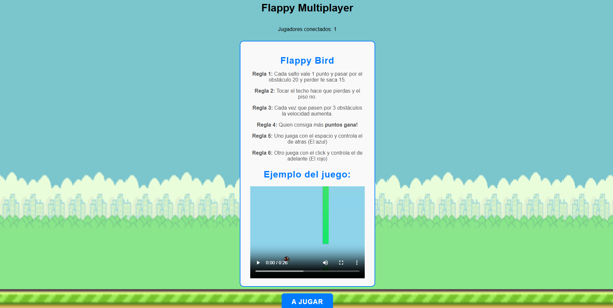
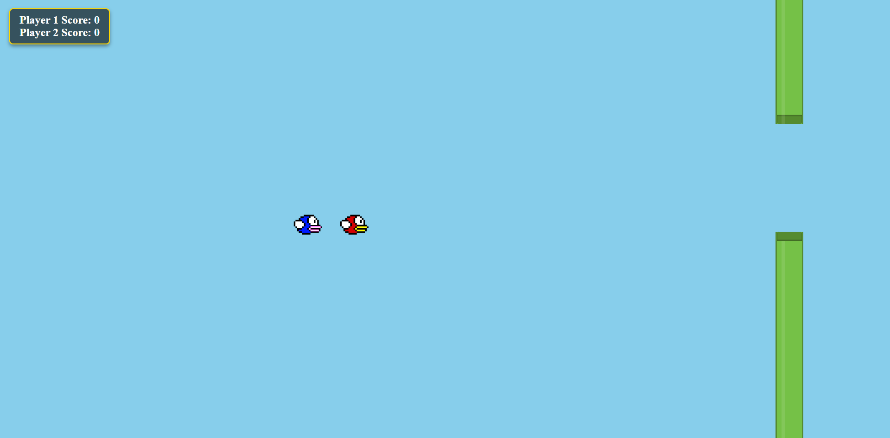

# Flappy Bird - Proyecto Next.js
# Integrantes
- Juan Cruz Prado
- Francisco Rebelo
- Mauro Velozo

* Descripción del Proyecto *

Nuestro proyecto es una inspiracion en el juego Flappy Bird,el objetivo del juego es controlar un pájaro que vuela entre tuberías sin chocar, acumulando puntos a medida que avanza.
El que mas puntos consiga gana.
Cuando iniciamos el proyecto vemos las reglas del juego, donde estas reglas serian:

- Cada salto vale 1 punto y pasar por el obstáculo 20 y perder te saca 15.
- Tocar el techo hace que pierdas y el piso no.
- Cada vez que pasen por 3 obstáculos la velocidad aumenta.
- Quien consiga más puntos gana!
- Uno juega con el espacio y controla el de atras (El azul)
- Otro juega con el click y controla el de adelante (El rojo)

Abajo de las reglas vamos a tener un boton que no diriga al juego, donde si queremos iniciar dicho juego, pero solamente hay un cliente , el boton no funcionara, pero, si hay dos o mas, el boton funcionara y automaticamnete se va a poner un cronometro de 3 segundos. Terminado el cronometro, inicia el juego, donde se va a ver 2 jugadores, uno mas adelante que otro, donde el flappy de adelante se controla con el clikc y el de atras con el espacio, a medida que vayas avanzando los obstaculos del juego se pone mas dificil, cada 3 obstaculos aumenta la velocidad, haciendo un juego mucho mas competitivo y divertido. Este juego, se podra jugar minimo de a 4 o mas, ya que cuando inciamos dicho juego desde ambas computadoras, se correra a la vez el mismo.

* Objetivos del Proyecto *
Nuestro objetivo principal es hacer un juego competivo, divertido y dinamico, donde podes jugar con tus amigos y gracias a que las partidas no son muy largas podes rotar con la gente esperando por jugar. Por eso elegimos recrear el flappy Bird.

* Imagenes del proyecto *

